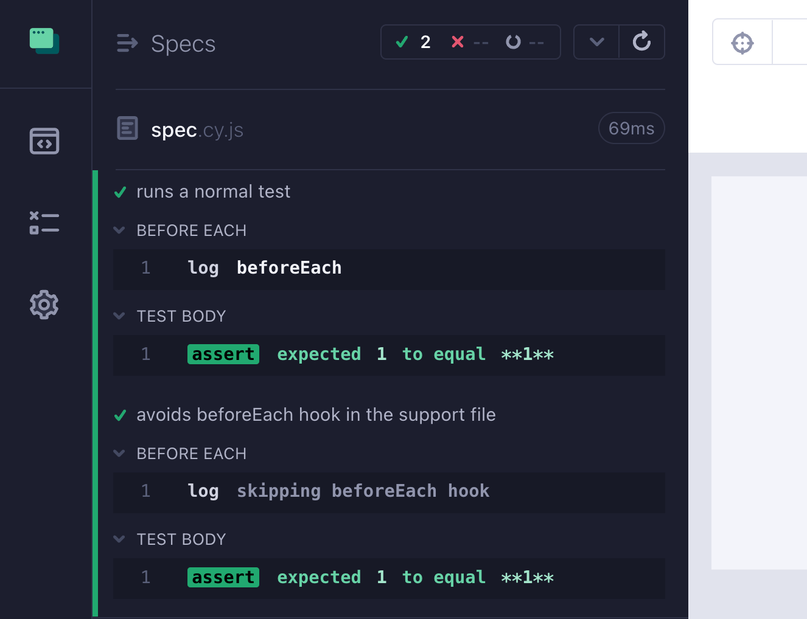

# control-before-each-example

> Control the beforeEach behavior using Cypress test config

See [spec.cy.js](./cypress/e2e/spec.cy.js) and [support/e2e.js](./cypress/support/e2e.js)

## Small print

Author: Gleb Bahmutov &lt;gleb.bahmutov@gmail.com&gt; &copy; 2022

- [@bahmutov](https://twitter.com/bahmutov)
- [glebbahmutov.com](https://glebbahmutov.com)
- [blog](https://glebbahmutov.com/blog)
- [videos](https://www.youtube.com/glebbahmutov)
- [presentations](https://slides.com/bahmutov)
- [cypress.tips](https://cypress.tips)
- [Cypress Tips & Tricks Newsletter](https://cypresstips.substack.com/)
- [my Cypress courses](https://cypress.tips/courses)

License: MIT - do anything with the code, but don't blame me if it does not work.
